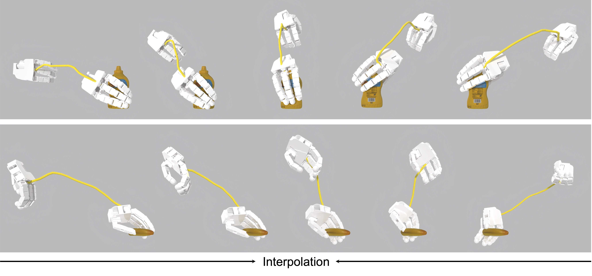
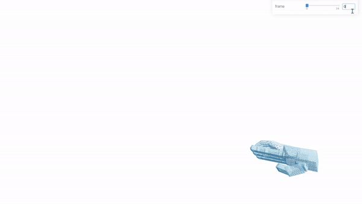
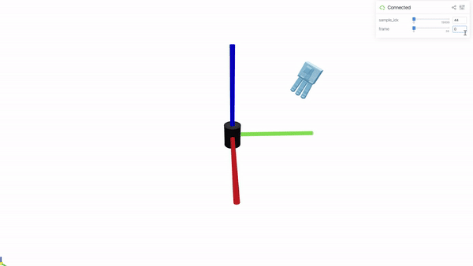

# Continuous Grasping Function

This repository is the official implementation of the paper:

> Learning Continuous Grasping Function with a Dexterous Hand from Human Demonstrations  
> [_Jianglong Ye_](https://jianglongye.com/)<sup>\*</sup>, [_Jiashun Wang_](https://jiashunwang.github.io/)<sup>\*</sup>, [_Binghao Huang_](https://binghao-huang.github.io/), [_Yuzhe Qin_](https://yzqin.github.io/), [_Xiaolong Wang_](https://xiaolonw.github.io/)  
> RA-L 2023, IROS 2023

[Project Page](https://jianglongye.com/cgf/) / [ArXiv](https://arxiv.org/abs/2207.05053) / [Video](https://www.youtube.com/watch?v=mJ2d7ZfNyUw)

<div align="center">
  
</div>

## Environment Setup

(Our code has been tested on Ubuntu 20.04, python 3.10, torch 1.13.1, CUDA 11.7 and RTX 3090)

To set up the environment, follow these steps:

```sh
conda create -n cgf python=3.10 -y && conda activate cgf
conda install pytorch==1.13.1 torchvision==0.14.1 torchaudio==0.13.1 pytorch-cuda=11.7 -c pytorch -c nvidia -y

pip install six numpy==1.23.1 tqdm pyyaml scipy opencv-python trimesh einops lxml transforms3d viser
pip install git+https://github.com/hassony2/chumpy.git
pip install git+https://github.com/hassony2/manopth
pip install git+https://github.com/facebookresearch/pytorch3d.git
pip install git+https://github.com/UM-ARM-Lab/pytorch_kinematics
```

## Data Preparation

We provide processed data for training CGF which can be downloaded from [here](https://drive.google.com/file/d/1O5FUeulQqM1ylXhU0WyjoIRyBvVZw27k/view?usp=sharing) and unzip it under `PROJECT_ROOT/data/`. The final file structure should look like this:

```
PROJECT_ROOT
├── ...
└── data
    ├── ...
    └── processed
        ├── ...
        ├── meta.json
        ├── pose_m_aug.npz
        └── pose_m_object_coord.npz
```

Alternatively, you can prepare the data by following the instructions below.

1. Download DexYCB data from the [official website](https://dex-ycb.github.io/) to `DEXYCB_DATA_ROOT` and organize the data as follows:
   ```
   DEXYCB_DATA_ROOT
   ├── 20200709-subject-01/
   ├── 20200813-subject-02/
   ├── ...
   ├── calibration/
   └── models/
   ```
2. Run the following script to process the data:
   ```sh
   python scripts/prepare_dexycb.py --data_root DEXYCB_DATA_ROOT
   python scripts/retargeting.py --mano_side left
   python scripts/retargeting.py --mano_side right
   ```
   The processed data will be saved to `PROJECT_ROOT/data/processed`. Retargeting results can be visualized by running the following command:
   ```sh
   python scripts/visualize_retargeting.py
   ```
   

## Running

### Training

To train the CGF model, run the following command:

```sh
# cd PROJECT_ROOT
python scripts/main.py
```

### Sampling

To sample from the trained CGF model, run the following command (replace `TIMESTAMP` with the timestamp of the checkpoint in the `PROJECT_ROOT/output` directory):

We provide a pre-trained model which can be downloaded from [here](https://drive.google.com/file/d/1enUS9p2-_pUFyMtwWzb3mJgq1l0Tjy9a/view?usp=sharing) and unzip it under `PROJECT_ROOT/output/`.

```sh
# cd PROJECT_ROOT
python scripts/main.py --mode sample --ts TIMESTAMP
```

The sampled results will be saved to `PROJECT_ROOT/output/TIMESTAMP/sample`. They can be visualized by running the following command:

```sh
python scripts/visualize_sampling.py --ts TIMESTAMP
```



To evaluate the smoothness of the sampled grasps (table 1 in the paper), run the following command:

```sh
python scripts/eval_generation.py --ts TIMESTAMP
```

Note that the evaluation results may vary slightly due to the randomness in the sampling process.

### Simulation

Our simulation environment is adapted from [dex-hand-teleop](https://github.com/yzqin/dex-hand-teleop). To setup the simulation environment, follow these steps:

```sh
pip install sapien==2.2.2 gym open3d
```

To run the simulation, run the following command (replace `SAPIEN_SAMPLE_DATA_PATH` with the path to a sample data in the `PROJECT_ROOT/output/TIMESTAMP/sample/result_filter_sapien` directory):

```sh
python scripts/sim.py --data_path SAPIEN_SAMPLE_DATA_PATH
```

## Citation

```bibtex
@article{ye2023learning,
  title={Learning continuous grasping function with a dexterous hand from human demonstrations},
  author={Ye, Jianglong and Wang, Jiashun and Huang, Binghao and Qin, Yuzhe and Wang, Xiaolong},
  journal={IEEE Robotics and Automation Letters},
  year={2023}
}
```
